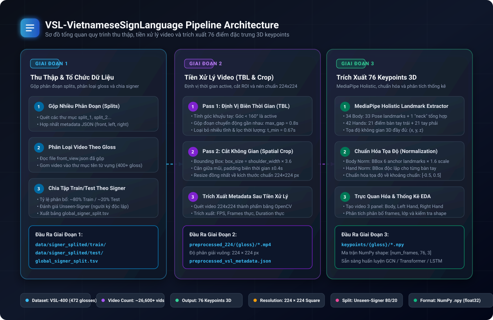

# VSL-VietnameseSignLanguage: Pipeline Tiền Xử Lý & Trích Xuất Đặc Trưng 3D Keypoints

Hệ thống xử lý dữ liệu và trích xuất đặc trưng chuyển động cho bài toán **Nhận Diện Ngôn Ngữ Ký Hiệu Việt Nam (Vietnamese Sign Language - VSL)** dựa trên tập dữ liệu **VSL-400** và **VSL-UIT**.

Dự án cung cấp một quy trình hoàn chỉnh từ dữ liệu video thô, qua định vị biên thời gian (Temporal Boundary Localization - TBL), cắt khung hình (Spatial Crop & Resize 224x224), đến trích xuất 76 tọa độ keypoints 3D chuẩn hóa sử dụng MediaPipe Holistic phục vụ huấn luyện các mô hình Deep Learning (GCN, Transformer, LSTM).

---

## 1. Tính Năng Nổi Bật

- **Gộp và tổ chức dữ liệu**: Hỗ trợ gộp nhiều phân đoạn (splits) thành một kho lưu trữ tập trung và phân loại tự động vào từng thư mục gloss (từ vựng ký hiệu).
- **Chia tập Train/Test theo Signer**: Chia tách dữ liệu theo định danh người ký (Signer ID) để đảm bảo đánh giá khách quan trên những người ký chưa từng xuất hiện trong quá trình huấn luyện (Unseen-Signer Evaluation).
- **Temporal Boundary Localization (TBL)**: Lọc bỏ các khung hình bất động ở đầu và cuối video dựa trên thuật toán tính góc khuỷu tay (Elbow Angle) từ MediaPipe Pose (ngưỡng góc < 160° xác định trạng thái ký hiệu active).
- **Spatial Crop & Resize 224x224**: Tự động xác định vùng quan tâm (Region of Interest - ROI) quanh phần đầu, vai và eo dựa trên khoảng cách hai vai (shoulder width × 3.6), nén về kích thước chuẩn 224x224 pixel.
- **Trích xuất 76 Keypoints 3D Chuẩn Hóa**: Sử dụng MediaPipe Holistic để trích xuất 34 điểm cơ thể (bao gồm điểm neck tổng hợp) và 42 điểm bàn tay (21 điểm mỗi bàn tay). Tọa độ được chuẩn hóa độc lập theo bounding box về khoảng [-0.5, 0.5].
- **Hỗ trợ đa hình thức sử dụng**: Cung cấp đầy đủ cả 3 Jupyter Notebooks trực quan lẫn các script CLI dòng lệnh hỗ trợ đa tiến trình (multiprocessing).

---

## 2. Cấu Trúc Thư Mục Dự Án

```
VSL-VietnameseSignLanguage/
│
├── .gitignore                      # Cấu hình loại trừ dữ liệu video, npy, checkpoints
├── LICENSE                         # Giấy phép mã nguồn mở MIT
├── pyproject.toml                  # Cấu hình gói Python chuẩn
├── README.md                       # Tài liệu hướng dẫn tổng quan dự án
├── requirements.txt                # Danh sách thư viện phụ thuộc
│
├── notebooks/                      # Các Jupyter Notebook tương tác
│   ├── 01_data_collection.ipynb              # Thu thập, gộp splits, phân loại gloss & chia signer
│   ├── 02_data_cleaning_and_imputation.ipynb # Tiền xử lý TBL, Crop 224x224 & trích xuất JSON metadata
│   ├── 03_exploratory_data_analysis.ipynb    # Trích xuất 76 keypoints 3D & phân tích thống kê EDA
│   ├── requirements.txt                      # Dependencies dành riêng cho notebook
│   └── README.md                             # Hướng dẫn sử dụng notebooks
│
├── src/                            # Mã nguồn mô-đun hóa Python
│   ├── __init__.py
│   ├── data/
│   │   ├── __init__.py
│   │   ├── merge_splits.py         # Mô-đun gộp splits và hợp nhất danh sách JSON
│   │   ├── categorize.py           # Mô-đun phân loại video theo gloss
│   │   └── split_signer.py         # Mô-đun chia train/test theo Signer ID
│   ├── preprocessing/
│   │   ├── __init__.py
│   │   ├── tbl.py                  # Thuật toán định vị biên thời gian TBL
│   │   ├── cropper.py              # Thuật toán cắt không gian và resize về 224x224
│   │   ├── metadata.py             # Trích xuất metadata sau tiền xử lý
│   │   └── batch_processor.py      # Xử lý hàng loạt đa nhân CPU (ProcessPoolExecutor)
│   └── features/
│       ├── __init__.py
│       ├── keypoints.py            # Trích xuất 76 điểm landmarks bằng MediaPipe Holistic
│       ├── normalizer.py           # Chuẩn hóa tọa độ cơ thể (1.6x bbox) và bàn tay
│       └── visualizer.py           # Tạo video animation skeleton 3 panel
│
├── scripts/                        # Các script CLI chạy độc lập từ terminal
│   ├── 01_run_collection.py
│   ├── 02_run_preprocessing.py
│   └── 03_run_feature_extraction.py
│
├── data/                           # Thư mục chứa dữ liệu (được bỏ qua trong git)
│   └── README.md                   # Hướng dẫn tổ chức dữ liệu
│
└── legacy/                         # Lưu trữ các file code / notebook nguyên bản
    ├── extract_vsl_info.py
    ├── main_preprocessing.ipynb
    ├── merge_2_dataset.ipynb
    ├── merge_splits.py
    ├── split_front_view_by_signer.py
    ├── vsl400-keypoint-extract-new-1.ipynb
    └── worker_utils.py
```

---

## 3. Sơ Đồ Quy Trình Xử Lý (Pipeline Architecture)

<p align="center">
  
</p>

### Biểu Đồ Dòng Dữ Liệu Tương Tác (Interactive Flowchart)

```mermaid
flowchart TD
    subgraph S1["GIAI ĐOẠN 1: THU THẬP & PHÂN CHIA DỮ LIỆU"]
        A1["Dataset Gốc VSL-400 / VSL-UIT<br/>(split_1, split_2, ...)"] --> B1["Gộp Splits & Metadata JSON<br/>src/data/merge_splits.py"]
        B1 --> C1["Phân Loại Video Theo Gloss<br/>src/data/categorize.py"]
        C1 --> D1["Chia Tập Train/Test Theo Signer<br/>src/data/split_signer.py (~80/20)"]
        D1 --> E1["Đầu ra: data/signer_splited/<br/>• train/{gloss}/*.mp4<br/>• test/{gloss}/*.mp4<br/>• global_signer_split.tsv"]
    end

    subgraph S2["GIAI ĐOẠN 2: TIỀN XỬ LÝ VIDEO (TBL & SPATIAL CROP)"]
        E1 --> A2["Video Thô Từ Tập Train/Test"]
        A2 --> B2["Pass 1: Định Vị Biên Thời Gian (TBL)<br/>• Góc khuỷu tay < 160° là active<br/>• Gộp gap 0.8s, lọc t_min >= 0.67s"]
        B2 --> C2["Pass 2: Cắt Không Gian (Spatial Crop)<br/>• Box = Khoảng cách vai × 3.6<br/>• Căn giữa mũi, padding ±0.4s<br/>• Nén về chuẩn 224×224 px"]
        C2 --> D2["Trích Xuất Metadata JSON Sau Xử Lý<br/>• FPS, Frames thực, Duration thực"]
        D2 --> E2["Đầu ra: data/preprocessed_224/<br/>• Video chuẩn hóa 224×224 px<br/>• preprocessed_vsl_metadata.json"]
    end

    subgraph S3["GIAI ĐOẠN 3: TRÍCH XUẤT 76 KEYPOINTS 3D & EDA"]
        E2 --> A3["Video Chuẩn Hóa 224×224"]
        A3 --> B3["MediaPipe Holistic Extractor<br/>• 34 Body Landmarks (gồm neck)<br/>• 42 Hand Landmarks (21 mỗi tay)"]
        B3 --> C3["Chuẩn Hóa Tọa Độ Không Gian ([-0.5, 0.5])<br/>• Body: BBox 6 anchor × 1.6 scale<br/>• Hands: BBox độc lập từng bàn tay"]
        C3 --> D3["Lưu Ma Trận NumPy [num_frames, 76, 3]<br/>src/features/keypoints.py (.npy)"]
        D3 --> E3["Trực Quan Hóa Skeleton & Thống Kê EDA<br/>• Video animation 3 panel (Body, Left, Right)<br/>• Phân tích phân bố frames & gloss"]
        E3 --> F3["Đầu ra: data/keypoints/{gloss}/*.npy<br/>(Sẵn sàng huấn luyện GCN / Transformer / LSTM)"]
    end

    classDef stage1 fill:#0F172A,stroke:#38BDF8,stroke-width:2px,color:#F8FAFC
    classDef stage2 fill:#0F172A,stroke:#A855F7,stroke-width:2px,color:#F8FAFC
    classDef stage3 fill:#0F172A,stroke:#34D399,stroke-width:2px,color:#F8FAFC
    class S1 stage1
    class S2 stage2
    class S3 stage3
```



### Bảng Thống Kê Chi Tiết Các Giai Đoạn

| Tiêu chí | Giai đoạn 1: Thu thập & Phân chia | Giai đoạn 2: Tiền xử lý (TBL & Crop) | Giai đoạn 3: Trích xuất 76 Keypoints 3D |
|:---|:---|:---|:---|
| **Mục tiêu chính** | Hợp nhất dữ liệu thô, phân loại gloss và chia train/test theo người ký | Lọc bỏ tĩnh đầu/cuối, cắt ROI cơ thể và chuẩn hóa kích thước video | Trích xuất tọa độ 3D các khớp xương, chuẩn hóa và kiểm tra chất lượng |
| **Dữ liệu đầu vào** | Các thư mục `split_*` thô kèm file JSON metadata | Video thô trong `data/signer_splited/` | Video đã crop 224×224 trong `data/preprocessed_224/` |
| **Công nghệ / Thuật toán** | `Pathlib`, `Pandas`, `Shutil`, Hardlink/Copy | MediaPipe Pose, Elbow Angle 2D, Bounding Box 3.6×, OpenCV | MediaPipe Holistic, Anchor Normalization, NumPy, Matplotlib |
| **Tham số cốt lõi** | `train_ratio = 0.8`, `seed = 42` | `theta = 160°`, `max_gap = 0.8s`, `t_min = 0.67s`, `padding = 0.4s` | 34 Body + 42 Hands, Scale 1.6×, BBox Range `[-0.5, 0.5]` |
| **Đầu ra thành phẩm** | `data/signer_splited/train/`, `test/`, `global_signer_split.tsv` | `data/preprocessed_224/{gloss}/*.mp4` (224×224), `preprocessed_metadata.json` | `data/keypoints/{gloss}/*.npy` (shape `[num_frames, 76, 3]`), Video Animation |

---

## 4. Yêu Cầu Hệ Thống & Cài Đặt

### Yêu Cầu Hệ Thống

- **Hệ điều hành**: Windows 10/11, Ubuntu 20.04+, macOS.
- **Python**: 3.9 trở lên (khuyến nghị 3.10 hoặc 3.11).
- **RAM**: Tối thiểu 8 GB (khuyến nghị 16 GB+ khi xử lý đa tiến trình).
- **CPU**: 4 nhân trở lên (khuyến nghị 8+ nhân để tối ưu thời gian crop).

### Các Bước Cài Đặt

1. Clone repository:
```bash
git clone https://github.com/nguyenanfms/VSL-VietnameseSignLanguage.git
cd VSL-VietnameseSignLanguage
```

2. Khởi tạo môi trường ảo (virtual environment):
```bash
# Trên Windows
python -m venv venv
venv\Scripts\activate

# Trên Linux / macOS
python3 -m venv venv
source venv/bin/activate
```

3. Cài đặt các thư viện cần thiết:
```bash
pip install -r requirements.txt
```

4. Cài đặt package ở chế độ development (tùy chọn):
```bash
pip install -e .
```

---

## 5. Hướng Dẫn Sử Dụng

### Cách 1: Sử Dụng Jupyter Notebooks

Khởi động Jupyter Lab hoặc Jupyter Notebook để thực hiện từng bước trực quan:
```bash
jupyter lab notebooks/
```

- `01_data_collection.ipynb`: Thực hiện gộp splits, phân chia gloss, chia train/test theo signer.
- `02_data_cleaning_and_imputation.ipynb`: Thực thi TBL và spatial crop, sau đó tự động trích xuất metadata JSON thực tế của tập video sạch.
- `03_exploratory_data_analysis.ipynb`: Trích xuất 76 tọa độ 3D keypoints theo batch, tạo video trực quan hóa 3 panel và phân tích thống kê dataset.

### Cách 2: Sử Dụng Các Script CLI

Bạn có thể chạy trực tiếp pipeline từ dòng lệnh với các tham số tùy biến:

#### Bước 1: Thu thập và tổ chức dữ liệu
```bash
python scripts/01_run_collection.py --action all --splits-root data/raw_splits --merged-dir data/merged
```

#### Bước 2: Tiền xử lý video (TBL & Crop)
```bash
python scripts/02_run_preprocessing.py --input-dir data/categorized --output-dir data/preprocessed_224 --target-size 224
```

#### Bước 3: Trích xuất keypoints 3D
```bash
# Chạy batch số 1 trên tổng số 4 batch
python scripts/03_run_feature_extraction.py --input-dir data/signer_splited/train --output-dir data/keypoints --batch-idx 1 --total-batches 4

# Tạo video trực quan hóa skeleton mẫu từ file .npy đã trích xuất
python scripts/03_run_feature_extraction.py --visualize-sample data/keypoints/Anh/sample.npy --vis-out data/sample_skeleton.mp4
```

---

## 6. Cấu Trúc Ma Trận Keypoints (76 Điểm 3D)

Mỗi file `.npy` đại diện cho một video được lưu dưới dạng mảng NumPy 3 chiều với shape: `[num_frames, 76, 3]`:

| Trục (Axis) | Kích thước | Ý nghĩa |
|-------------|------------|---------|
| Axis 0 | `num_frames` | Số lượng khung hình của đoạn ký hiệu sau TBL |
| Axis 1 | 76 | Danh mục 76 điểm khác nhau trên cơ thể và bàn tay |
| Axis 2 | 3 | Tọa độ không gian 3D (x, y, z) đã được chuẩn hóa |

Phân bố 76 điểm:
- **34 Body Landmarks**: 33 điểm từ MediaPipe Pose + 1 điểm `neck` tổng hợp (trung bình tọa độ hai vai).
- **21 Left Hand Landmarks**: Cổ tay và các khớp ngón tay trái.
- **21 Right Hand Landmarks**: Cổ tay và các khớp ngón tay phải.

---

## 7. Giấy Phép (License)

Dự án được phát hành dưới giấy phép [MIT License](LICENSE).
Tác giả: **Nguyen An** (nguyenanfms1401@gmail.com).
