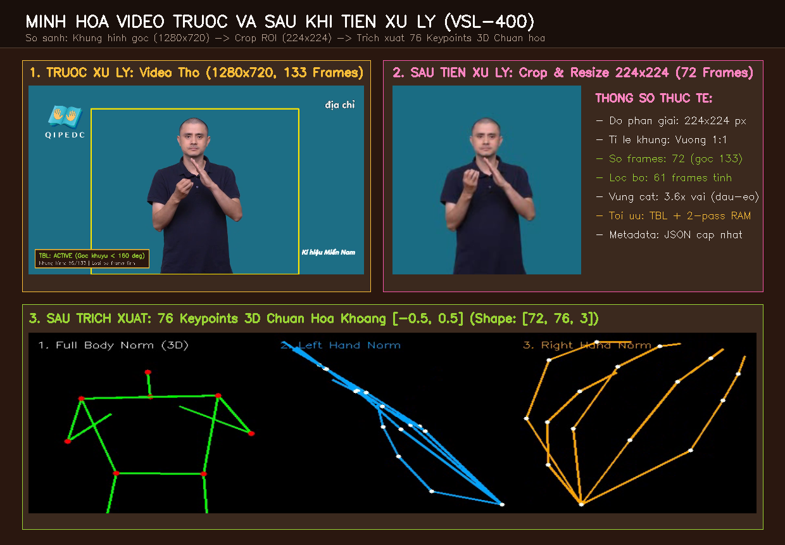

# VSL-VietnameseSignLanguage: 3D Keypoint Pipeline for Sign Language Recognition

## 1. TL;DR / Problem & Impact

Pipeline tiền xử lý video và trích xuất đặc trưng 3D keypoints chuẩn hóa cho bài toán **Nhận diện Ngôn ngữ Ký hiệu Việt Nam (VSL-400 & VSL-UIT)**. Hệ thống tự động cắt bỏ ~46% khung hình tĩnh dư thừa (Temporal Boundary Localization), chuẩn hóa ROI cơ thể về 224×224 px và chuyển đổi video thô thành ma trận 76 tọa độ 3D `[T, 76, 3]` — giảm >99% dung lượng I/O và sẵn sàng huấn luyện trực tiếp trên các mô hình GCN / Transformer.

<p align="center">
  
</p>

---

## 2. Architecture & Tech Rationale

### Tech Stack Theo Tầng

- **Data Ingestion & Splitting:** Python 3.10+, Pandas, OS/Shutil (chia tập Unseen-Signer độc lập, hợp nhất đa phân đoạn).
- **Temporal Localization & Spatial Crop:** MediaPipe Pose, OpenCV (tính góc khuỷu tay TBL, BBox động 3.6× khoảng cách hai vai).
- **Feature Extraction & Normalization:** MediaPipe Holistic, NumPy (34 body + 42 hand 3D keypoints, chuẩn hóa tọa độ `[-0.5, 0.5]`).
- **Execution & Tooling:** `concurrent.futures` (ProcessPoolExecutor đa tiến trình CPU), Click/Argparse CLI, Jupyter Lab.

### Tech Rationale & Trade-offs

- **MediaPipe Holistic vs. OpenPose / AlphaPose:** MediaPipe xử lý real-time trực tiếp trên CPU, không phụ thuộc CUDA/cuDNN phức tạp, trích xuất đồng thời Pose + Hands 3D với độ trễ thấp và footprint gọn nhẹ; chấp nhận trade-off nhỏ về độ chính xác ở góc nghiêng lớn vì dataset là góc nhìn chính diện (front-view).
- **Heuristic Elbow-Angle TBL vs. Deep Action Detection (SlowFast / BMN):** Thuật toán ngưỡng góc khuỷu tay ($\theta < 160^\circ$) xử lý nhanh gấp hàng chục lần, không cần gán nhãn frame-level hay tốn tài nguyên huấn luyện mạng định biên riêng mà vẫn loại bỏ chính xác các khung hình nghỉ tay đầu/cuối.
- **76 Keypoints 3D vs. Raw Video RGB:** Giảm kích thước mỗi mẫu từ ~20 MB xuống còn ~40 KB (giảm >99%), triệt tiêu hoàn toàn nhiễu môi trường, ánh sáng và màu sắc trang phục; cho phép huấn luyện ST-GCN / Transformer với VRAM < 2 GB.
- **Subject-Independent Split (80/20) vs. Random Split:** Phân chia triệt để theo Signer ID nhằm ngăn chặn rò rỉ dữ liệu (data leakage — mô hình học vẹt vóc dáng người ký thay vì ký hiệu), đảm bảo đánh giá khách quan năng lực tổng quát hóa thực tế.

---

## 3. Benchmark & Comparison Table

| Chỉ số / Đặc tính | Raw Video Baseline | Pipeline Sau Xử Lý (TBL + 224px) | 3D Keypoint Features (`.npy`) |
| :--- | :--- | :--- | :--- |
| **Dung lượng / Mẫu** | ~15 – 30 MB (MP4 720p) | ~1 – 2 MB (MP4 224×224) | **~15 – 50 KB** (`float32`) |
| **Mật độ thông tin** | Chứa 30 – 50% khung tĩnh | Cắt sát chuyển động ký hiệu | **100% tọa độ vận động chuẩn hóa** |
| **Chi phí VRAM GPU** | 16 – 24 GB+ (3D CNN) | 8 – 12 GB (2D/3D CNN) | **< 2 GB** (GCN / Transformer) |
| **Thời gian train/epoch**| Baseline (1.0× - Chậm) | ~3× nhanh hơn | **>20× nhanh hơn** |
| **Độ rò rỉ (Leakage)** | Nguy cơ cao nếu chia ngẫu nhiên | Đã gán nhãn signer chuẩn | **Tách biệt hoàn toàn Signer Train/Test** |

---

## 4. Clean Setup Guide

### Prerequisites

- **OS:** Linux (Ubuntu 20.04+), Windows 10/11, macOS.
- **Python:** `3.10` hoặc `3.11` (khuyến nghị 3.11).
- **Hardware:** Tối thiểu 8 GB RAM (khuyến nghị 16 GB+ khi chạy đa tiến trình CPU), CPU 4+ cores.

### Quickstart

```bash
# 1. Clone repository
git clone https://github.com/nguyenanfms/VSL-VietnameseSignLanguage.git
cd VSL-VietnameseSignLanguage

# 2. Khởi tạo môi trường ảo
# Windows:
python -m venv venv
.\venv\Scripts\activate
# Linux/macOS:
python3 -m venv venv
source venv/bin/activate

# 3. Cài đặt dependencies và package ở chế độ editable
pip install --upgrade pip
pip install -r requirements.txt
pip install -e .

# 4. Chạy pipeline tiền xử lý (CLI)
# Bước A: Gộp splits và chia signer
python scripts/01_run_collection.py --action all --splits-root data/raw_splits --merged-dir data/merged

# Bước B: Cắt khung hình TBL & Resize 224x224
python scripts/02_run_preprocessing.py --input-dir data/categorized --output-dir data/preprocessed_224 --target-size 224

# Bước C: Trích xuất 76 Keypoints 3D
python scripts/03_run_feature_extraction.py --input-dir data/signer_splited/train --output-dir data/keypoints --batch-idx 1 --total-batches 4

# Tùy chọn: Chạy trực quan bằng Jupyter Lab
jupyter lab notebooks/
```

---

## 5. Repo Hygiene & Contribution

### Commit Message Convention

Dự án áp dụng chuẩn [Conventional Commits](https://www.conventionalcommits.org/):

- `feat:` Bổ sung mô-đun hoặc tính năng xử lý mới trong pipeline.
- `fix:` Sửa lỗi logic, out-of-bounds bounding box, hoặc xử lý ngoại lệ video.
- `docs:` Cập nhật tài liệu kỹ thuật, hướng dẫn hoặc markdown notebooks.
- `refactor:` Tối ưu hóa cấu trúc code không làm thay đổi hành vi đầu ra.
- `perf:` Tối ưu hiệu năng CPU / I/O đa tiến trình.

### Branch & PR Workflow

1. Nhánh chính `main` luôn ở trạng thái production-ready và bảo vệ toàn vẹn lịch sử git.
2. Tạo nhánh nhánh tính năng theo định dạng: `feat/<feature-name>` hoặc `fix/<bug-name>`.
3. Giữ git history sạch: Sử dụng **Squash and Merge** hoặc **Rebase** khi hợp nhất PR.
4. **Tuyệt đối không commit dữ liệu thô hoặc artifacts nặng** (`.mp4`, `.npy`, `.json` dữ liệu lớn, thư mục `venv/` hoặc checkpoint) vào repository — tất cả đã được khai báo loại trừ trong `.gitignore`.
